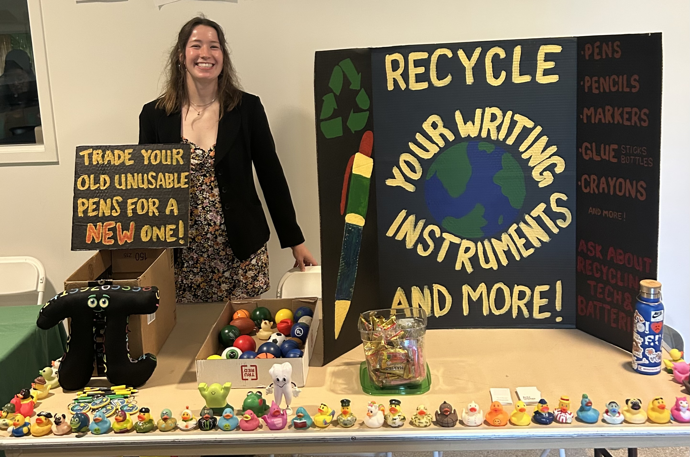

<nav style="font-size: 1.1em; margin-bottom: 20px;">
  <a href="index.html" style="margin-right: 15px;">Home</a>
  <a href="research.html" style="margin-right: 15px;">Research</a>
  <a href="activities.html" style="margin-right: 15px;">Professional activities</a>
  <a href="extras.html">Extras</a>
</nav>

# Other (non-math) stuff I do

## Writing instrument recycling program
I run a small recycling program for used pens, pencils, markers, and other school supplies at GMU. Inspired by the abundance of dry erase markers I have seen thrown away in the academic community, I set up collection boxes within our department and ensure these items are recycled in an earth-friendly way. Contact me to ask questions or participate in the program!

  

---

## Blood donation
My family and I are frequent blood donors; my brother and I had a birthday blood drive this year (May 2026), in which we successfully collected 24 units of whole blood and 2 units of double red cells. Even our local fire department showed up to support! <a href="bdayblooddrive (2).pdf" target="_blank">Here's the flyer</a>.

  
  

---

## Mentions in the media
- Graduate and professional student week: <a href="https://www.instagram.com/p/DWZeeWQCvgB/" target="_blank">shoutout by GMU's College of Science</a>
  (March 2026)
