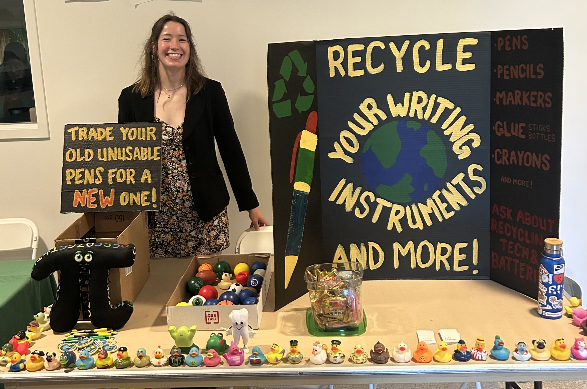

<nav style="font-size: 1.1em; margin-bottom: 20px;">
  <a href="index.html" style="margin-right: 15px;">Home</a>
  <a href="research.html" style="margin-right: 15px;">Research</a>
  <a href="activities.html" style="margin-right: 15px;">Professional activities</a>
  <a href="extras.html">Extras</a>
</nav>

# Other (non-math) stuff I do

## Writing instrument recycling program
I run a small recycling program for used pens, pencils, markers, and other school supplies at GMU. Inspired by the abundance of dry erase markers I have seen thrown away in the academic community, I set up collection boxes within our department and ensure these items are recycled in an earth-friendly way. Contact me to ask questions or participate in the program!
- Current dropbox: Exploratory Hall 4307 (Fairfax GMU campus)

  

---

## Blood donation
My family and I are frequent blood donors. Donating blood is so meaningful to us that my brother and I had a birthday blood drive this year (May 2026). We successfully collected 24 units of whole blood and 2 units of double red cells. Even our local fire department showed up to support! Check out the flyer <a href="bdayblooddrive (2).pdf" target="_blank">here</a>.
- Stay tuned for next year's birthday blood drive!

  
  

---

## Mentions (and sitings) in the media
- Sustainability month: <a href="https://www.instagram.com/reel/Dd9rGfONWEO/?utm_source=ig_web_button_share_sheet&stkn=MzRlODBiNWFlZA%3D%3D" target="_blank">shoutout by Science at Mason</a> in reference to my writing instrument recycling program (October 2026)
- Girl scout camp: a camp at which I volunteer was <a href="https://www.wusa9.com/article/features/volunteer-girl-scout-camp-oakton-virginia/65-fb4b7aea-ca6e-41ae-957b-4b5409e716f5" target="_blank">featured in the news</a>! You can find me in the crowd at 0:45 and 1:56 (hint: I'm wearing a blue shirt and a pale green hat) (July 2026)
- Graduate and professional student week: <a href="https://www.instagram.com/p/DWZeeWQCvgB/" target="_blank">shoutout by GMU's College of Science</a>
  (March 2026)
- Inova Blood Donor Services: <a href="https://www.facebook.com/share/p/1UfdNQPgxk/" target="_blank">post</a> announcing the reopening of a blood donation center (August 2024)
- International day of women and girls in science: <a href="https://www.facebook.com/share/p/1FUoDoXfwc/" target="_blank">feature by GMU's College of Science</a> (February 2024)
