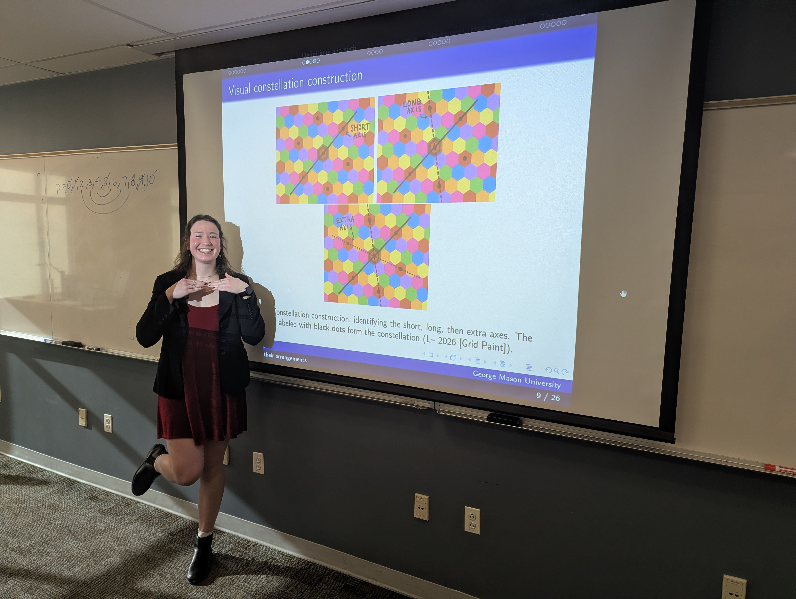
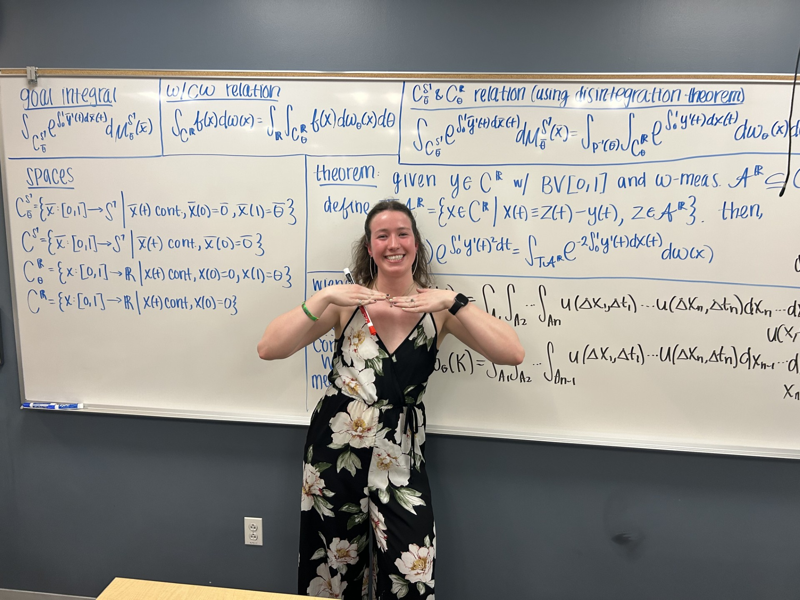

<nav style="font-size: 1.1em; margin-bottom: 20px;">
  <a href="index.html" style="margin-right: 15px;">Home</a>
  <a href="research.html">Research</a>
</nav>

# Research

## Interests
My research interests include:
- measure theory and probability theory
- analysis (including geometric analysis)
- mathematics in neuroscience

---

## Current Projects
### Grid cells and their arrangements
Grid cells are a type of neuron; research suggests they are involved in spatial trajectory encoding. A possible set of axioms for coding trajectory imply that the firing fields of grid cells form a hexagonal lattice. The aim of this project is to classify all possible arrangements of grid cells in these lattices.
- Collaborators: Dr. Rebecca R.G. (GMU), Dr. Holger Dannenger (GMU), Dr. Giorgio Ascoli (GMU)
- Partially supported by NSF grant DMS-2424326   

---

## Talks & Presentations  
- **Grid cells and their arrangements**, Student Research Talks (StReeTs), GMU, February 2026   
  <a href="gridcells.pdf" target="_blank">View flyer</a>
  - Based on work with Dr. Rebecca R.G. (GMU)
  

    
  

- **An integral over continuous paths in S^1**, Student Research Talks (StReeTs), GMU, March 2025  
  <a href="pathspaceintegral.pdf" target="_blank">View flyer</a>  
  - Based on work with Dr. Yiannis Loizides (GMU)
  

    
  

---
